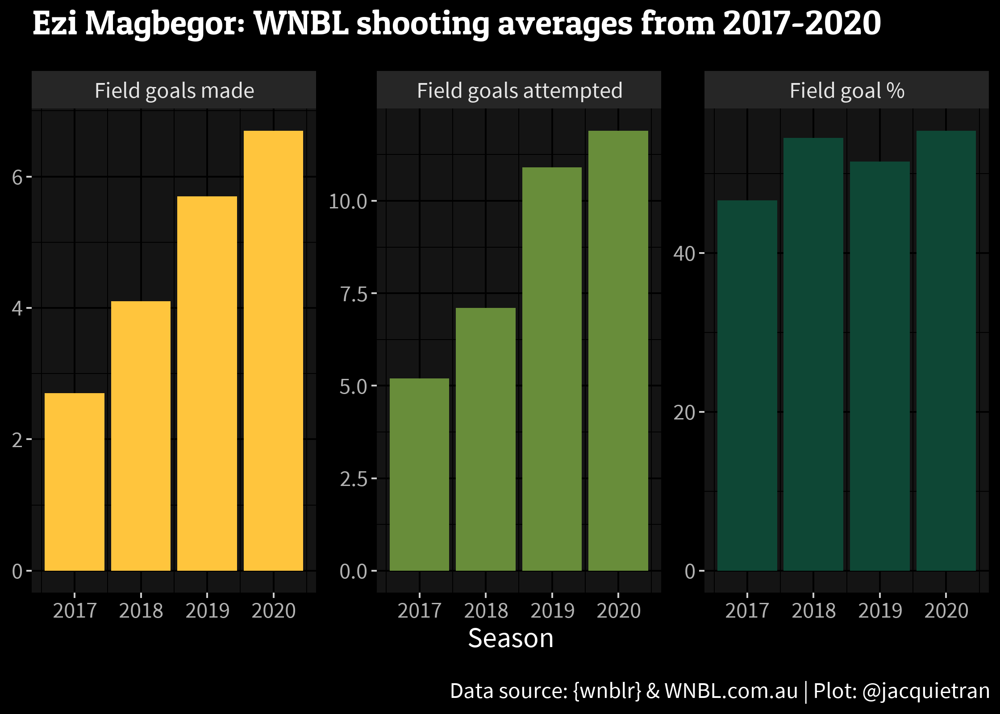

<!-- README.md is generated from README.Rmd. Please edit that file -->

# wnblr  

<!-- badges: start -->

<a href="https://www.repostatus.org/#wip"></a>
[](https://github.com/badges/shields)
[](https://github.com/jacquietran/wnblr/issues)
<!-- badges: end -->

The `wnblr` package contains a range of game statistics from the
Australian [**Women’s National Basketball League
(WNBL)**](https://www.wnbl.com.au):

-   `box_scores`: Team-level box scores, with all your usual basketball
    box score metrics like points scored, field goals made / attempted,
    free throws made / attempted, rebounds, turnovers, and the like.
-   `box_scores_detailed`: Player-level box scores.
-   `pbp`: Play-by-play data.
-   `shots`: Shots data, primarily containing XY shot locations.

## Installation

Install the development version of `wnblr` from GitHub with:

``` r
# install.packages("remotes")
remotes::install_github("jacquietran/wnblr")
```

## Examples

There’s lots to work with - for example, here’s a quick look at the
`shots` data:

``` r
# Load libraries
library(wnblr)
library(dplyr)

# Frequency of shot types attempted in the 2020 season
shots %>%
  filter(season == 2020) %>%
  select(sub_type, shot_result) %>%
  group_by(sub_type) %>%
  summarise(n = n()) %>%
  ungroup() %>%
  arrange(desc(n))
#> # A tibble: 10 x 2
#>    sub_type               n
#>    <chr>              <int>
#>  1 jumpshot            3381
#>  2 layup               2003
#>  3 drivinglayup         779
#>  4 pullupjumpshot       648
#>  5 turnaroundjumpshot   414
#>  6 stepbackjumpshot     209
#>  7 hookshot             162
#>  8 floatingjumpshot     141
#>  9 fadeaway              42
#> 10 alleyoop               1
```

It’s a smooth run from data to plot, too:

``` r
# yellow = #FFC53D
# green = #0E4735

# Load libraries
library(ggplot2)
library(showtext)

# Tidy data
magbegor <- box_scores_detailed %>%
  filter(scoreboard_name == "E. Magbegor") %>%
  select(season, contains("field_goals")) %>%
  group_by(season) %>%
  summarise(
    fgm = round(mean(field_goals_made), 1),
    fga = round(mean(field_goals_attempted), 1),
    fgpct = round(mean(field_goals_percentage), 1)) %>%
  ungroup() %>%
  tidyr::pivot_longer(
    cols = c("fgm", "fga", "fgpct"),
    names_to = "key",
    values_to = "value") %>%
  mutate(
    key = case_when(
      key == "fgm"   ~ "Field goals made",
      key == "fga"   ~ "Field goals attempted",
      key == "fgpct" ~ "Field goal %"),
    key = factor(
      key, levels = c("Field goals made",
                      "Field goals attempted",
                      "Field goal %")),)

# Import Google Fonts
font_add_google(name = "Patua One", family = "patua")
font_add_google(name = "Source Sans Pro", family = "source")

# Build plot
showtext_auto()
ggplot(magbegor,
       aes(x = season, y = value, group = key, fill = key)) +
  facet_wrap(~key, nrow = 1, scales = "free_y") +
  geom_bar(stat = "identity") + 
  labs(
    title = "Ezi Magbegor: WNBL shooting averages from 2017-2020",
    x = "Season", y = NULL,
    caption = "Data source: {wnblr} & WNBL.com.au | Plot: @jacquietran") +
  ggdark::dark_mode() +
  theme(legend.position = "none",
        text = element_text(
          colour = "#FFFFFF", family = "source", size = 14),
        plot.title = element_text(
          family = "patua", margin=margin(0,0,15,0)),
        plot.caption = element_text(margin=margin(15,0,0,0)))
```



``` r
# showtext_auto(FALSE) to close off
```

## Hex logos

Courtesy of
[**@PythonUnicornCoder**](https://github.com/PythonUnicornCoder) - thank
you!!
